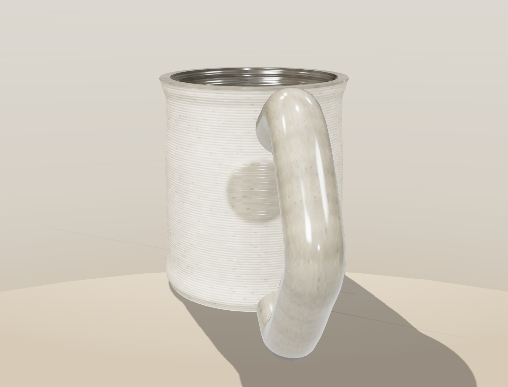

# Render — глазурованная керамика

Лёгкий WebGL-рендер кружки, напечатанной из глины на 3D-принтере. Снаружи
видна слоистость экструзии; глазурь прозрачная и глянцевая, поэтому она не
закрашивает глину, а делает её примерно на 30% темнее и насыщеннее под
стеклянным покрытием.



## Что сейчас в кадре

- Два варианта глины: чистая серо-бежевая и тёмная «асфальт».
- Прозрачная глянцевая глазурь: внутри чашки, на ободке (1 мм), на круглом
  рельефе снаружи и на ручке.
- Круглый барельеф встроен в геометрию стенки, а маска глазури использует ту
  же конфигурацию рельефа — покрытие ложится точно на выпуклость.
- Несколько слоёв мягких теней: настоящая PCF-тень от ключевого света плюс
  три широких радиальных градиента, как в студийном продуктовом кадре.

## Запуск

```bash
npm install
npm run dev
```

Продакшн-сборка:

```bash
npm run build
npm run preview
```

Единственная runtime-зависимость — [`three`](https://www.npmjs.com/package/three).
Текущая версия опубликована на `gh-pages` для живого превью.

## Структура

```
src/
  main.js            сцена, свет, мягкие тени, выбор глины
  cupGeometry.js     параметрическая геометрия кружки со слоями печати
  medallion.js       конфигурация круглого барельефа
  ceramicTextures.js процедурные карты двух глин и прозрачной глазури
```
